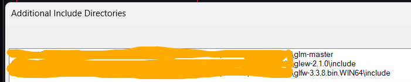
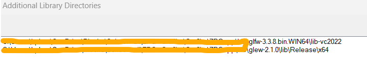
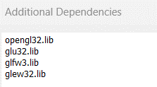
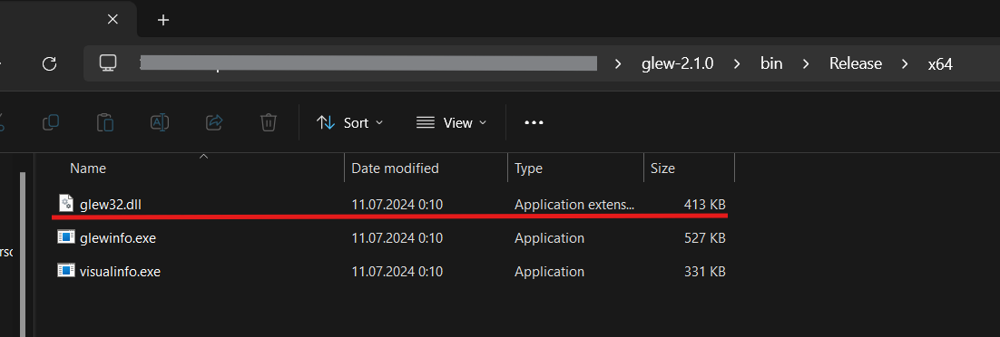
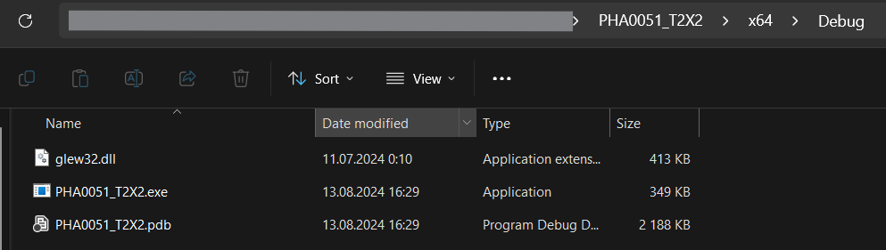

## Libraries that will be needed
- [GLFW](http://www.glfw.org/download.html) (binary x64)
- [GLM](https://github.com/g-truc/glm/releases) (zip)
- [GLEW](http://glew.sourceforge.net/) (bin)

## How to set up your project in vs2022
- Right-click on your project name -> select properties
- Configuration properties -> C/C++ -> Additional Include Directories  

- Configuration properties -> Linker -> General -> Additional Library Directories  

- Configuration properties -> Linker -> Input -> Additional Dependencies  

*Now try running a code  to see if it worked!!*
[test file 1](tester/test_1/main.cpp)

## NOTICE!
- if you'll go past excercise 1, make sure to copy file called glew32.dll from glew and copy it into your debug folder in your project

